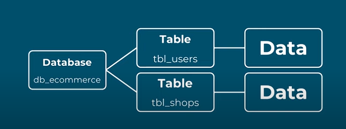

# SQL Introduction

### What is SQL?
**SQL** or **Structured Query Language** is a Query Language specifically designed for managing data in a database.

It is used in almost every platform when it regards to database learning this would be a great help when **starting to learn how to connect databases** using **other programming languages.**

---
### What is a Database?
it is a **structured set of data** held in a computer / server, which can be accessed by programs / softwares for use in their system.

---
### Database Structure
In SQL databases are often displayed as a **set of tables** wherein **tables** contains a **row for EACH INDIVIDUAL** and **column for EACH DATA OF AN INDIVIDUAL.**

### (in Table  Schema)
|  |  | ***tbl_users*** |  |
| ----------- | ----------- | ----------- | ----------- |
| **UID** | **userName** | **emailAddress** | **ownedShop**|
| 1 | Kkuru Lee | kkuru@gmail.com | Shapi |
| 2 | Jiro Pasco | jiropasco@gmail.com | None |
| 3 | Ssamu Kim | ssamu@gmail.com | Lazzy |
| 4 | Wonchae Aeri | wonchae@gmail.co | None |

---
### (Primary Key)
The **Unique** data that is used to identify an individual set of data.

|  |
| ----------- |
|**UID**|
| 1 |
| 2 |
| 3 |
| 4 |