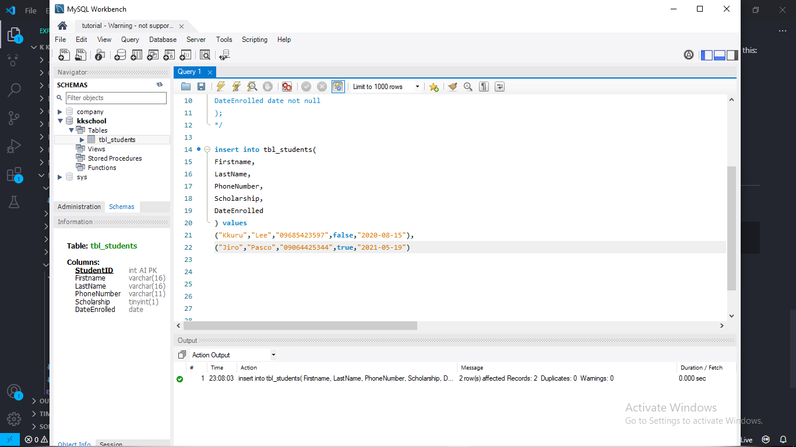

# SQL Create

### Database Structure (Full Schema)

---

### ***Creating a Database***
    CREATE DATABASE database_name;

(I use mySQL workbench for this one)

go to "Schemas" and refresh it in order to see your created database:

---
### ***Creating a Table***
    CREATE TABLE table_name (variable datatype);
    //or
    CREATE TABLE table_name (variable datatype constraint);

### ***Constraints***
- **Not Null** - Will not accept empty values.
- **Unique** - Will not accept duplicate values.
- **Primary Key** - Will not accept empty and duplicate values.

### **Auto-Increment**
This keyword is used so that your **primary key** would be **automatically generated** for you. **IT ONLY WORKS WITH NUMERICAL DATA**.

### ***Most Common SQL Datatype***
**Numeric Data**
- **Interger/Int** = Stores numeric values from -2147483648 to 2147483647.
- **Double** = Stores numeric values with decimals with lower floating point than float.
- **Float** = Stores numeric values with decimals with a high floating point.
- **Bool** = Stores TRUE = 1 or FALSE = 0.

**Text Data**
- **Varchar** = Set of characters with a width or size up to 8000 characters.
- **Text** = Set of characters with the size of 2GB text data.

**Time Data**
- **Date** = Stores Date in the format YYYY-MM-DD.
- **TIME** = Stores Time in the format hh:mm:ss.
- **DateTime** = Stores Date and Time in the format YYYY-MM-DD hh:mm:ss.

**Miscellaneous Data**
- **Blob** = Stores large binary data.

---
Lets try to use it in mySQL workbench...

Just to make sure that we create the table, just refresh the schema and it must look like this: 

---
### ***Inserting Data***
    INSERT INTO table_name(p1,p2...) VALUES (v1,v2...);

example in mySQL Workbench:

just to make sure that the values are in the recors, just right-click at the "tbl_students" at the schema and click "select rows - Limit 1000" and it should look like this: 

