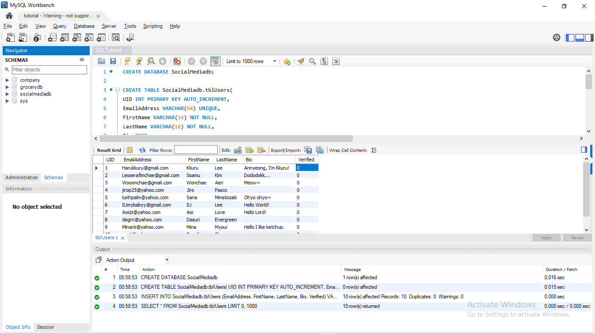
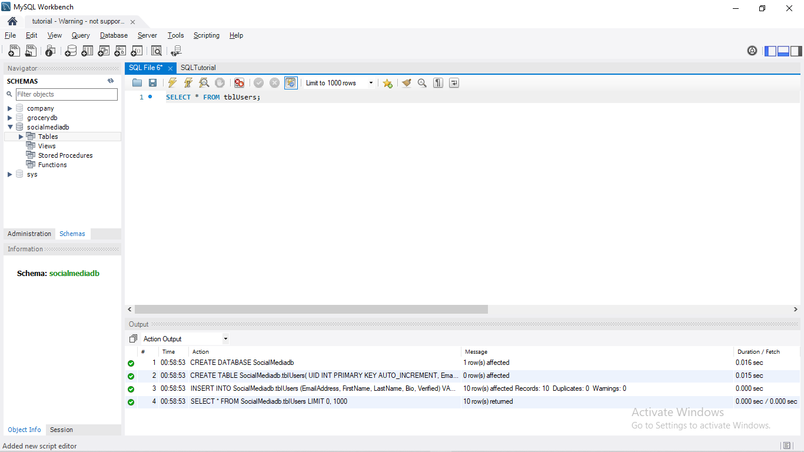
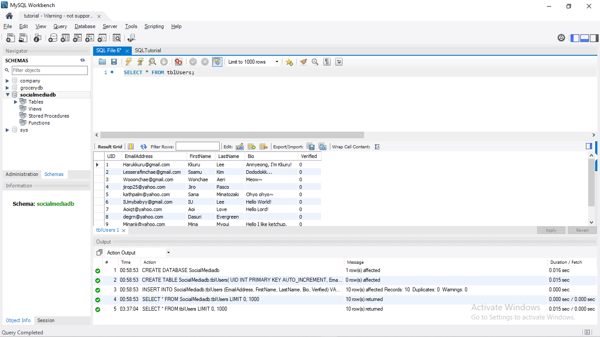
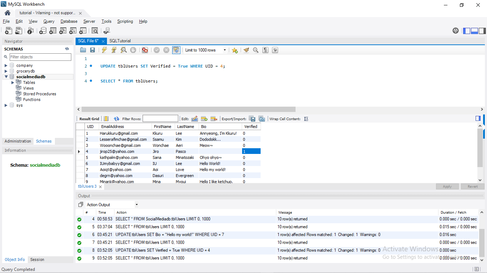
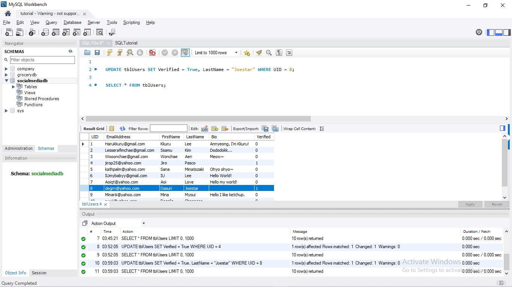
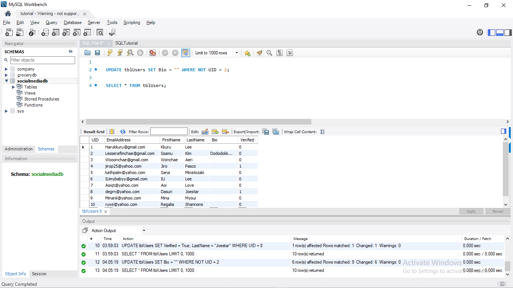
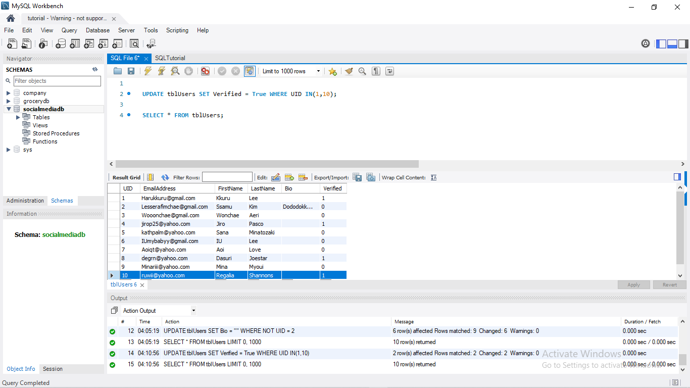

# SQL Update

For this md, I want to create a new database. The file is at below:

[SocMedDB](images/SQLTutorial.sql)

Just click the execute (thunder) button in order to create a database table.

---
### ***Updating Data***
    UPDATE table_name SET p1,p2... WHERE condition

### ***Set Keyword***
Indicates what columns is to be updated and what value should it use to update the data with.

### ***Where Keyword***
The WHERE Keyword is used to UPDATE certain ROW in the table.  

**IF SAFE MODE IS ON**.  
**WHERE** is necessary.  
**WHERE** must always use a **PRIMARY KEY**

---
### ***CONDITIONAL OPERATORS***

| Label | Symbol |
| ----------- | ----------- |
| Equals | = |
| NOT Equals | <> 
| Less Than | < 
| Less Than or Equals | <= 
| Greater Than | > 
| Greater Than or Equals | >= 

---

Go back to your workbench and create a new SQL file just like this:

Make sure that the schema is in the *socialmediadb* before executing.

I want to change Aoi Love's bio to "HELLO MY WORLD!". Just use this command:  

    UPDATE SET Bio = "Hello my world!" WHERE UID = 7;

As you can see, Aoi's bio (Hello Lord!) was changed to *Hello my world*.

---

For more example, I want to verify Jiro's account. So I will just use this command:

    UPDATE SET Verified = TRUE WHERE UID = 4;

Jiro's account is now verified. (Take note that Boolean is a numeric datatype)

---

Next example, I want to change Dasuri's Lastname to Joestar and also want to verify her.

    UPDATE SET Verified = TRUE, LastName = "Joestar" WHERE UID = 8;

Dasuri's Lastname is now updated and at the same time verified.

---

### ***NOT Keyword***
The NOT Keyword is used to invert the WHERE CONDITION.

For example, I want to remove everyone's bio except Ssamu.

    UPDATE SET Bio = "" WHERE NOT UID = 2;

Everyone's bio are now removed except Ssamu.

---

### ***IN Keyword***
It is used after the WHERE keyword to update multiple rows.

For example, I want to verify Kkuru and Regalia's account.

    UPDATE SET Verified = TRUE WHERE UID IN (1,10);

Kkuru and Regalia are now verified!