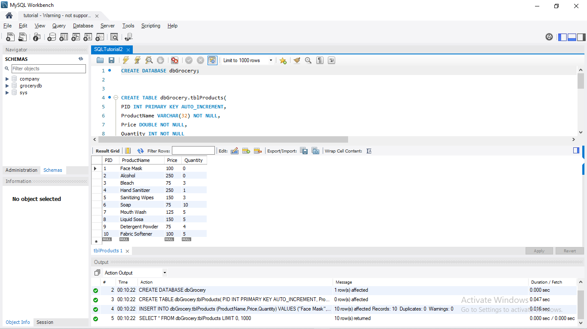
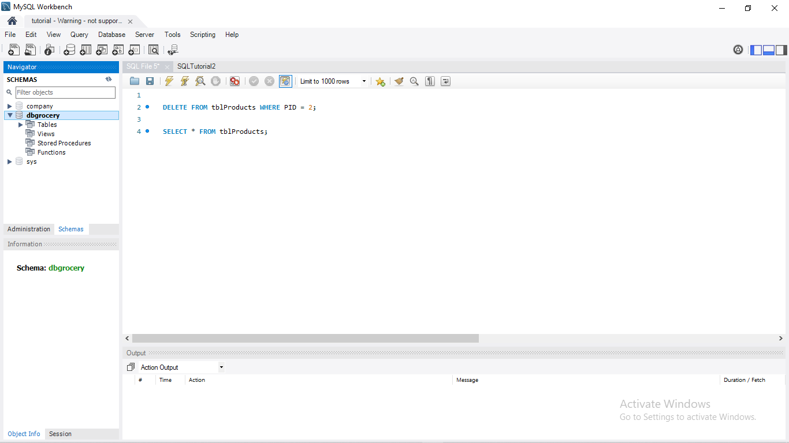
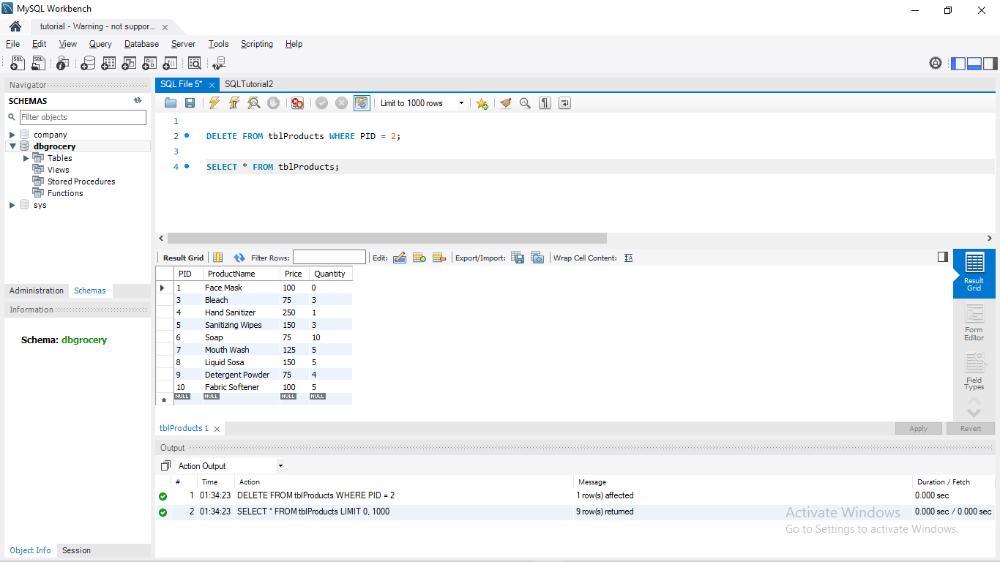
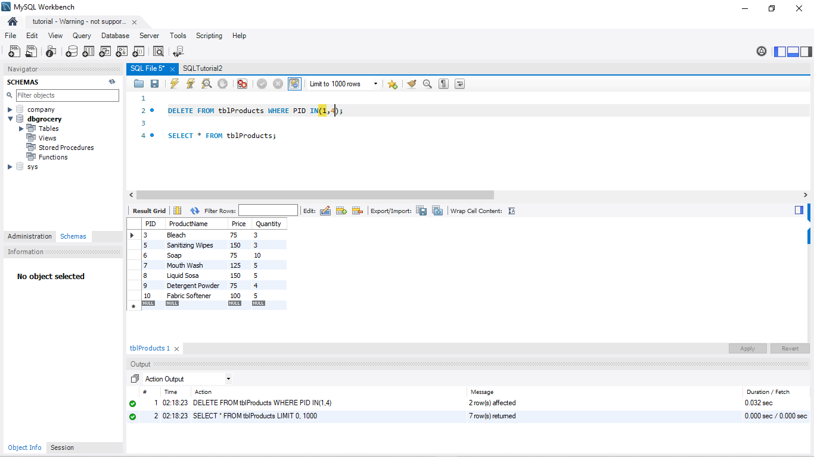
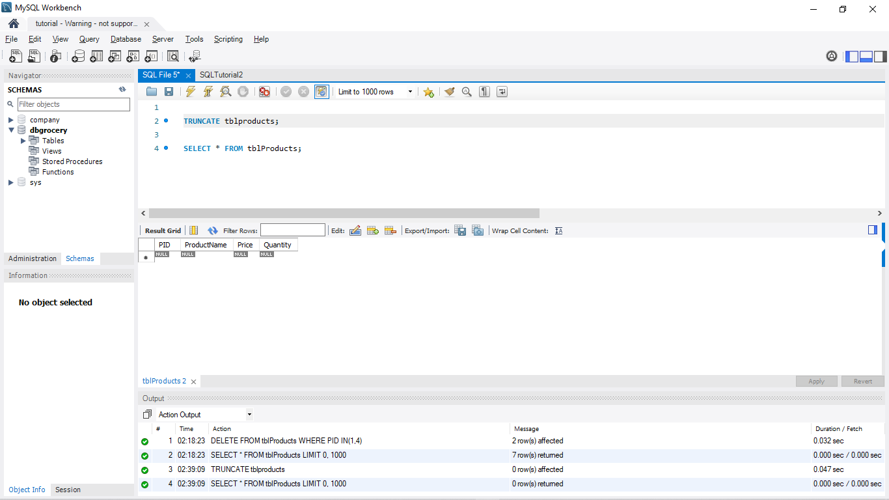
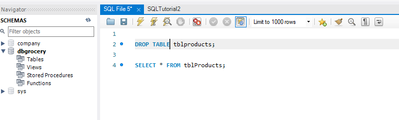

# SQL Delete

For this md, I want to create a new database. The file is at below:

[GroceryDB](images/SQLTutorial2.sql)

Just click the execute (thunder) button in order to create a database table.

---

### ***Deleting Data***
    DELETE FROM table_name WHERE condition

### ***Where Keyword***
The WHERE Keyword is used to DELETE certain / multiple ROWS in the table.  

**IF SAFE MODE IS ON**.  
**WHERE** is necessary.  
**WHERE** must always use a **PRIMARY KEY**

---
For the first example, I want to delete the product "Alcohol"

    DELETE FROM tblProducts WHERE PID = 2;

before executing your file, make sure that the schema is in the *dbgrocery*.

The Alcohol is now gone from the table.

---

### ***CONDITIONAL OPERATORS***

| Label | Symbol |
| ----------- | ----------- |
| Equals | = |
| NOT Equals | <> 
| Less Than | < 
| Less Than or Equals | <= 
| Greater Than | > 
| Greater Than or Equals | >= 

---

### ***IN Keyword***
It is used after the WHERE keyword to delete multiple rows.

For example, I want to delete "Face Mask" and "Hand Sanitizer" from the table.

    DELETE FROM tblProducts WHERE PID IN(1,4);

The "Face Mask" and "Hand Sanitizer" are now removed from the table.

---

### ***NOT Keyword***
The NOT Keyword is used to invert the WHERE CONDITION.

If I want to remove all products except "Fabric Conditioner":

    DELETE FROM tblProducts WHERE NOT PID = 10;

In this case, I will not make an example because it may cause mass deletion.

---
### ***TRUNCATE TABLE***
if you want to delete all data in the table.  

    TRUNCATE table_name;

As you can see, the data are now deleted. Be careful when using this.

---
### ***DROP KEYWORD***
DELETES a TABLE or a DATABASE.

    DROP TABLE table_name;
    DROP DATABASE database_name;

There are no table left in this database.