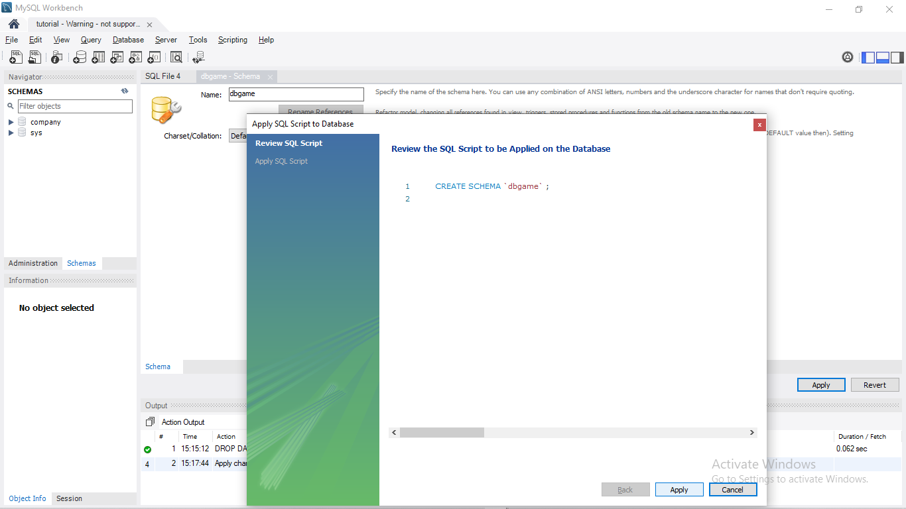
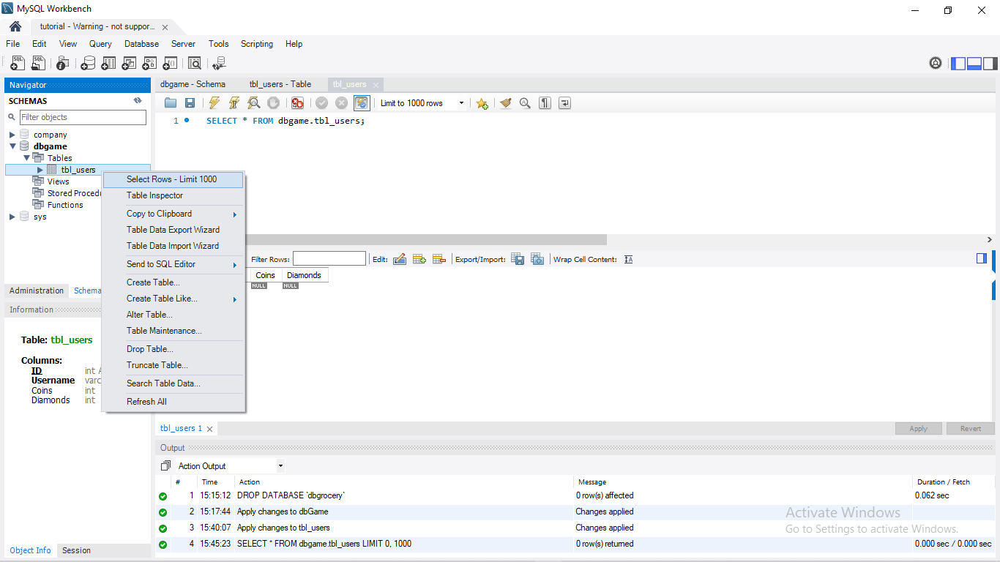
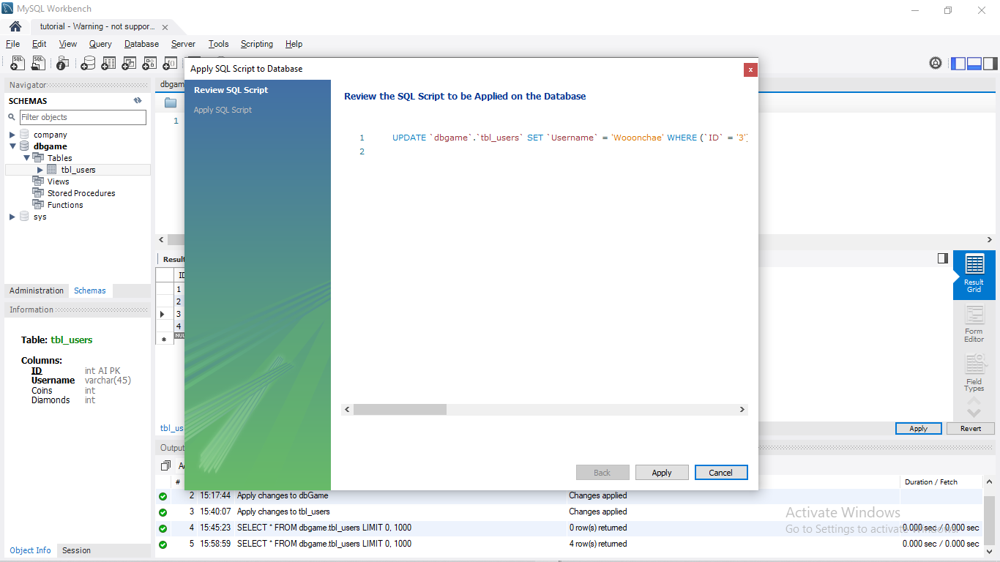

# SQL The Easy Mode

### ***Creating a Database***
How to create a database without coding "*CREATE DATABASE table_name*"? Here's what you can do:

 just click on the pointed icon and name your database just like this:

I want to create a new game database so I named it "*dbgame*". After naming your database, click **Apply**.

You have now created a new database!

---

### ***Creating a Table***

You don't want to code "*CREATE TABLE table_name(variable datatypes)*"? There is an easy way to create a table without actually coding it...

You can right-click on the *Table* under the **dbgame** schema then click on *Create Table*. It should be like this:

I want to name my table **tbl_users** and create four column names with a *Primary Key*.

As you can see, I create four different column name:  
ID (Primary Key), Username, Coins, Diamonds.

You've noticed that we have to check first what type of constraints we should use for each name. 

| Initials | Meaning |
| ----------- | ----------- |
| PK | Primary Key |
| NN | Not Null |
| UQ | Unique |
| B  | Binary |
| UN | Unsigned |
| ZF | Zero Fill |
| AI | Auto-Increment |
| G  | Generated |

After I fill the table columns, click **Apply** to review your SQL Script.

You have now created a new Table! If you want to see your data/s in the table: 

Right-click on *tbl_users* and select **Select-Rows - Limit 1000**.

---

### ***Inserting Data***

Want to input data the easy way? Here's what you should do:

Just fill out the table, That's it... really, oh yes click apply to save your data!

After reviewing your SQL Data, click **Apply** to finally insert your data in the table. That's really it, you've made the data!

What?!?!! You don't want to edit in table form? Alright, I've got you covered...

Just click on **Form Editor** in order to create a new data.

Just like the other one, click apply to review your SQL Script and click apply again if you are sure with it.

You have now added a new data!

---

### ***Updating Data***
What!??!! You've got a typographical error on your data? Well, here's what you should do to update your data:

Just double-click on the data you want to update and click apply. Easy right?

Click apply if you are sure and ta-daa! You've now updated your data!

---

### ***Deleting Data***
Do you want to delete your data and you are lazy to code it? Alright alright I got you...

Just right-click on the data that you want to delete and just click **Delete Row(s)**.

After you've deleted the row, click apply to review it and apply again if you are sure with it.

You've now deleted a row data! Easy as 1-2-3 right?

---